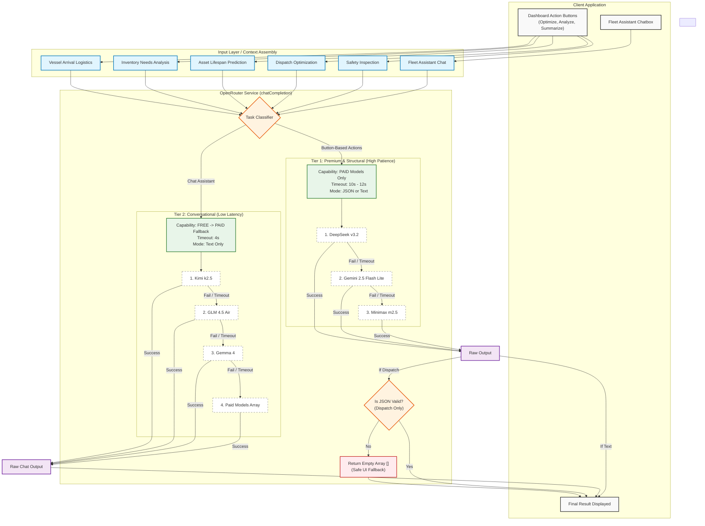

# Fleet Dispatch System - AI Routing Architecture

This diagram illustrates the routing architecture, showing the split between button-triggered premium tasks and the conversational chat fallback loops.

